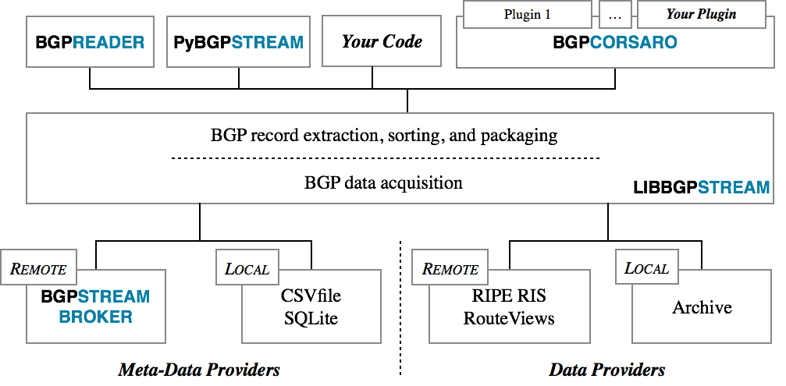

# BGP Stream
> [www](https://bgpstream.caida.org/) | [github](https://github.com/caida/libbgpstream) | [bgpstream-info@caida.org](mailto:bgpstream-info@caida.org)

### Overview
- [BGP Stream: A framework for BGP analysis](https://ripe70.ripe.net/presentations/55-bgpstream.pdf) *(pdf)*

# Install BGP Stream

You can visit the official [install page](https://bgpstream.caida.org/docs/install) to see if there is a different approach you want to take. There is also a [docker](https://hub.docker.com/r/caida/bgpstream) image.

The follow outlines compiling it from source for simplicity across distros.

###### Requirements
- [libcurl](https://curl.se/libcurl/)
- [wandio 4.2.4-1](https://github.com/LibtraceTeam/wandio/releases/tag/4.2.4-1) *(wandio 4.2.5 was released recently, but not sure if it will break bgpstream)*

###### Compiling wandio
1. Install the required packages: `build-essential curl zlib1g-dev libbz2-dev libcurl4-openssl-dev librdkafka-dev automake1.11 libtool`
2. Grab the source: `curl -LO https://github.com/LibtraceTeam/wandio/archive/refs/tags/4.2.4-1.tar.gz`
3. Extract the archive & then compile with `./configure && make && sudo make install`
4. Lastly, run `sudo ldconfig`

###### Compiling libbgpstream
1. Install required packages: `sudo apt-get install -y curl apt-transport-https ssl-cert ca-certificates gnupg lsb-release`
1. Grab the source: `curl -LO https://github.com/CAIDA/libbgpstream/releases/download/v2.2.0/libbgpstream-2.2.0.tar.gz`
2. Extract the archive & then compile with `./configure && make && sudo make install`
3. Lastly, run `sudo ldconfig`

This will create `/usr/local/bin/bgpreader` *([documentation](https://bgpstream.caida.org/docs/tools/bgpreader))*

Lastly, for Python support, `pip install pybgpstream` *([documentation](https://bgpstream.caida.org/docs/api/pybgpstream))* *([pypi](https://pypi.org/project/pybgpstream/))*

**NOTE:** `sudo apt-get install python3-pybgpstream`

**NOTE:** The [Broker HTTP API](https://bgpstream.caida.org/docs/api/broker) may come to use...
